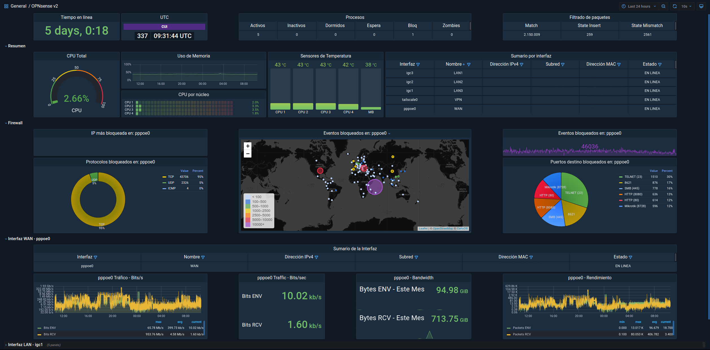

<h1>
  

    
     
    OPNsense Dashboard
  
 
</h1>

<h2> 
  

    Un panel para OPNsense basado en el de Brendan Smith (bsmithio), y retocado por mí. 
	  Basedo en InfluxDB, Graylog, Mongo, ElasticSearch y Grafana
  

</h2>

### PRÓXIMAMENTE™
